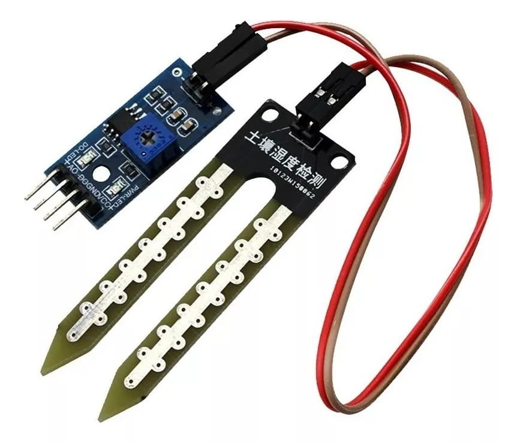

# **KIT DE 71 COMPONENTES ELECTRONICOS PARA MICRO:BIT Y ARDUINO**
*Componente dentro del kit de sensores, actuadores y componentes basicos para aula-laboratorio de informática y robótica*
# **Sensor de humedad en suelo**
## **1. Descripción**
Tensión de funcionamiento: 3.3V -5 V

Sensibilidad ajustable por potenciómetro

Modo de salida dual : analógica y digital

LED rojo - indicador de encendido

LED verde - indicador de salida de conmutación digital

Medidas PCB: 3 x 1.5 cm

Medidas Sonda: 6  x 3 cm

## **2. Web de interes**
https://electropeak.com/learn/interfacing-capacitive-soil-moisture-sensor-module-with-arduino/
## **3. Foto**

