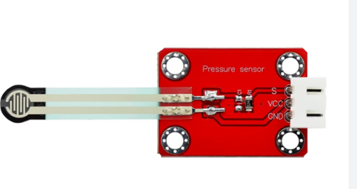

# **KIT DE 71 COMPONENTES ELECTRONICOS PARA MICRO:BIT Y ARDUINO**
*Componente dentro del kit de sensores, actuadores y componentes basicos para aula-laboratorio de informática y robótica*
# **Sensor de presión táctil**
## **1. Descripción**
Voltaje de funcionamiento: 3.3-5VDC

Rango: 0-0.5Kg

Espesor: <0.25mm

Punto de respuesta: <20g

Repetibilidad: <±5.8%(50% de la carga)

Precisión: ±2.5%(85% range interval)

Resistencia inicial: >100MO (sin carga)

Tiempo de respuesta:<1ms

Tiempo de recuperación:<15ms

Vida útil: >100 mil veces
## **2. Web de interes**

## **3. Foto**

