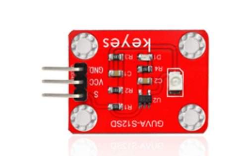

# **KIT DE 71 COMPONENTES ELECTRONICOS PARA MICRO:BIT Y ARDUINO**
*Componente dentro del kit de sensores, actuadores y componentes basicos para aula-laboratorio de informática y robótica*
# **Sensor GUVA-S12D 3528 Luz Ultravioleta**
## **1. Descripción**
El sensor UV GUVA-S12SD 3528 está especializado para la medición de luz ultravioleta

Su puerto de conexión es compatible con la entrada del sensor en Micro:bit,  Arduino u otros microcontroladores.

Es un sensor UV que contiene el GUVA-S12SD, que puede usarse ampliamente para la indexación inteligente de dispositivos UV, como relojes con detección exponencial UV, teléfonos inteligentes con detección de índice UV, equipos de detección UV para exteriores, etc. También se puede usar para controlar la intensidad de los rayos UV, detectores de llama UV, desinfección UV. 

Especificaciones:

Voltaje de funcionamiento: 3.3-5V (DC)

Interfaz: 3PIN

Señal de entrada: señal analógica

Rango de detección espectral: 240-370 nm

Área activa: 0.076 mm2

Respuesta: 0.14A / W

Corriente sin luz: 1nA

Corriente de luz: 101 a 125 nA UVA, 1 mW / cm2

Dimensiones: 2.2x3cm
## **2. Web de interes**

## **3. Foto**

