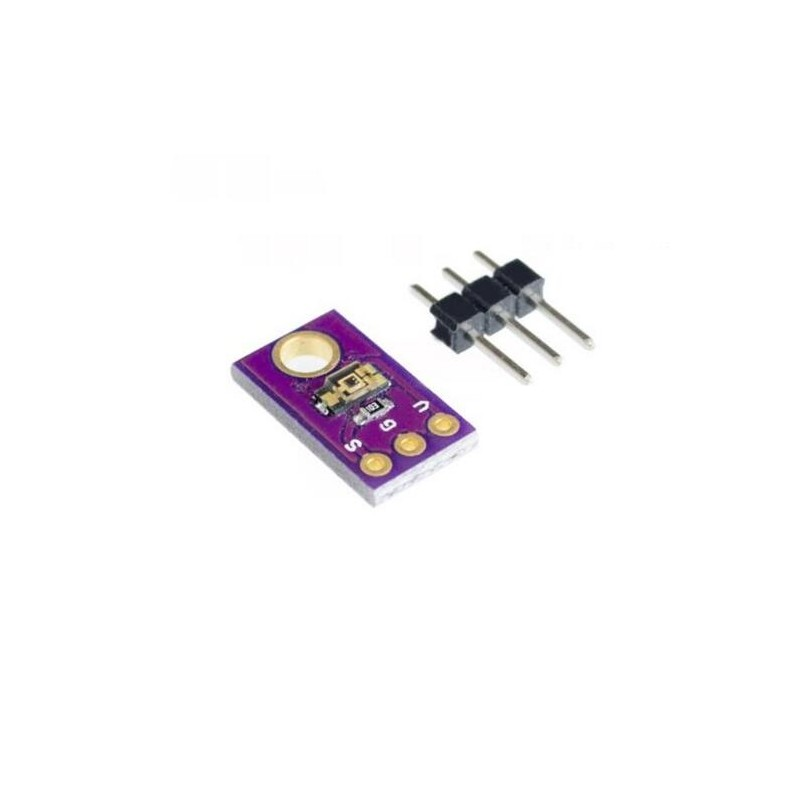

# **KIT DE 71 COMPONENTES ELECTRONICOS PARA MICRO:BIT Y ARDUINO**
*Componente dentro del kit de sensores, actuadores y componentes basicos para aula-laboratorio de informática y robótica*
# **Sensor TEMP6000 de luz ambiental**
## **1. Descripción**
Es un sensor de luz ambiente con una sensibilidad equivalente a la del ojo humano ya que, a diferencia de otros sensores, bloquea la banda infrarroja. Así, es altamente inmune a fuentes de radiación infrarroja (iluminación incandescente, luz solar, etc). Es capaz también de bloquear el rango ultravioleta de manera efectiva. El ángulo de detección es de +/-60º. Se puede alimentar a 3,3V/5V y proporciona una salida analógica de gran linealidad con la cantidad de luz recibida.

Conexionado:

VCC: Alimentación (3,3V / 5V). Nunca superar 6V.

GND: Masa

SIG: Salida analógica (tensión proporcional a la cantidad de luz).
## **2. Web de interes**
https://learn.sparkfun.com/tutorials/temt6000-ambient-light-sensor-hookup-guide
## **3. Foto**

