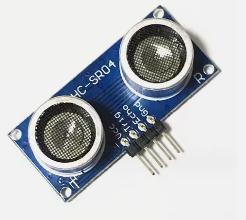

# **KIT DE 71 COMPONENTES ELECTRONICOS PARA MICRO:BIT Y ARDUINO**
*Componente dentro del kit de sensores, actuadores y componentes basicos para aula-laboratorio de informática y robótica*
# **Sensor Ultrasonidos HC-SR04**
## **1. Descripción**
Voltaje de Operación: 5V DC

Corriente de reposo: < 2mA

Corriente de trabajo: 15mA

Rango de medición: 2cm a 450cm

Precisión: +- 3mm

Ángulo de apertura: 15°

Frecuencia de ultrasonido: 40KHz

Duración mínima del pulso de disparo TRIG (nivel TTL): 10 µS

Duración del pulso ECO de salida (nivel TTL): 100-25000 µS

Dimensiones: 45*20*15 mm

Tiempo mínimo de espera entre una medida y el inicio de otra 20ms (recomendable 50ms)

## **2. Web de interes**
https://eloctavobit.com/modulos-sensores/modulo-hc-sr04-sensor-de-ultrasonido
## **3. Foto**

