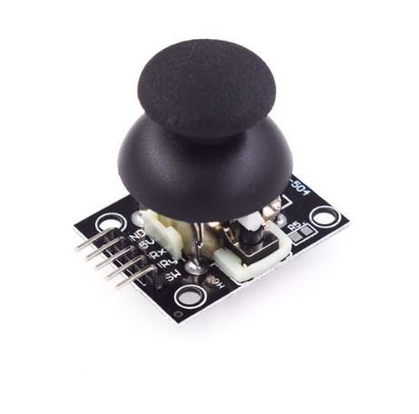

# **KIT DE 71 COMPONENTES ELECTRONICOS PARA MICRO:BIT Y ARDUINO**
*Componente dentro del kit de sensores, actuadores y componentes basicos para aula-laboratorio de informática y robótica*
# **Módulo Joystick**
## **1. Descripción**
JOYSTICK X EJE XY KY-023 (dual axis joystick module)

Módulo Joystick KY-023, de botón PS2 compatible con Arduino. Este módulo traduce los movimientos direccionales realizados por el botón mediante su doble eje X e Y, funcionando a través de potenciómetros.

Compatible con los microcontroladores Arduino, Micro:bit o similares y con conexiones mediante cables Dupont.
## **2. Web de interes**
https://arduinomodules.info/ky-023-joystick-dual-axis-module/
## **3. Foto**

