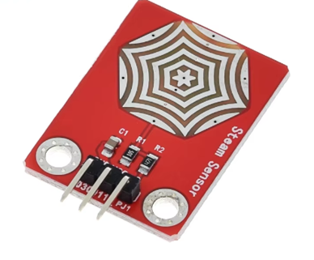

# **KIT DE 71 COMPONENTES ELECTRONICOS PARA MICRO:BIT Y ARDUINO**
*Componente dentro del kit de sensores, actuadores y componentes basicos para aula-laboratorio de informática y robótica*
# **Módulo Sensor de Vapor**
## **1. Descripción**
Voltaje de funcionamiento: 3,3 V o 5 V.

Consumo: <20mA

Rango de temperatura de trabajo: －10 ℃ a ＋ 70 ℃

Tipo de salida: señal analógica

S: señal de salida analógica

+: Alimentación positiva (VCC)

-： Alimentación negativa o masa (GND)

Peso: 2.9g
## **2. Web de interes**
https://wiki.dfrobot.com/Steam_Sensor__SKU_SEN0121_
## **3. Foto**

