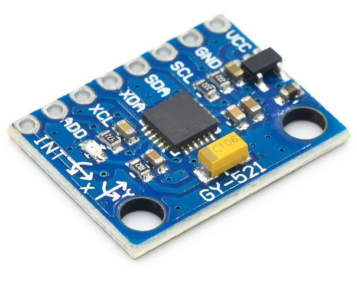

# **KIT DE 71 COMPONENTES ELECTRONICOS PARA MICRO:BIT Y ARDUINO**
*Componente dentro del kit de sensores, actuadores y componentes basicos para aula-laboratorio de informática y robótica*
# **Sensor giroscopio gy-521**
## **1. Descripción**
Sencillo acelerómetro y giroscopio de 3 ejes basado en el chip MPU-6050.

Módulo que permite medir la aceleración, inclinación y orientación en ejes X, Y y Z. Incorpora un procesador DMP que ejecuta complejos algoritmos para combinar las mediciones de los sensores internos, así nos evitamos cargar nuestro Arduino haciendo los cálculos. Además incorpora un sensor de temperatura, un reloj de alta precisión e interrupciones programables.

Puede ser alimentado directamente desde tu placa Arduino, ya que incluye un regulador de voltaje y el consumo es de apenas 3,5mA en uso.

Comunicación vía I2C o SPI.

Viene con dos tiras de 8 pines para soldar a la placa. Una con pines rectos y otra con pines en codo, para que sueldes el que mejor te convenga para tu proyecto.

Se alimenta a 3.3V pero dado que incluye un regulador interno podemos alimentarlo a 5V

CAD interno de 16 bits

Los giroscópios van ± 250 500 1000 2000 grados / seg

Gama de aceleración: ±2g, ±4g, ±8g, ±16g
## **2. Web de interes**
https://protosupplies.com/product/mpu-6050-gy-521-3-axis-accel-gryo-sensor-module/
## **3. Foto**

