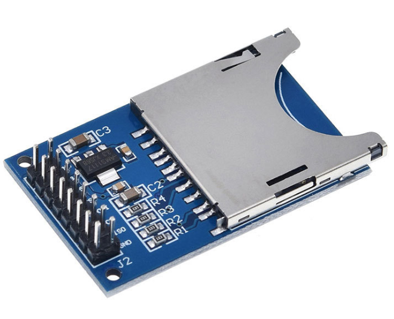

# **KIT DE 71 COMPONENTES ELECTRONICOS PARA MICRO:BIT Y ARDUINO**
*Componente dentro del kit de sensores, actuadores y componentes basicos para aula-laboratorio de informática y robótica*
# **Lector tarjeta SD**
## **1. Descripción**
Permite leer y escribir Tarjeta SD a través de Arduino

Fácilmente interconectable con Arduino

Todos los pines SD SPI se emiten, MOSI, SCK, miso y CS.

Punto de conexión: 16 pines

Ángulo del pin: 90 grados sobre la placa

Admite múltiples voltajes de entrada 5V / 3.3 V
## **2. Web de interes**
https://www.makerguides.com/a-complete-guide-to-arduino-and-sd-card-interface/
## **3. Foto**

