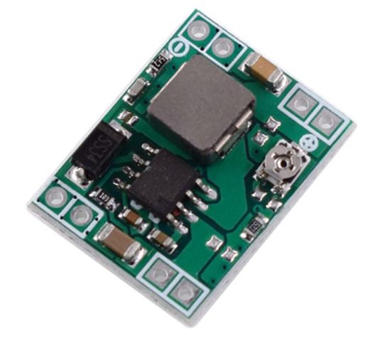

# **KIT DE 71 COMPONENTES ELECTRONICOS PARA MICRO:BIT Y ARDUINO**
*Componente dentro del kit de sensores, actuadores y componentes basicos para aula-laboratorio de informática y robótica*
# **Regulador tensión MP1584EN**
## **1. Descripción**
Voltaje de entrada: 4.5V a 28V DC

Voltaje de salida: 0.8V a 20V DC

V. Salida ajustable (el voltaje de entrada debe ser por lo menos 1.5V mayor que la salida)

Corriente de Salida: máx. 3A, 1A recomendado.

Potencia de salida: 20W

Eficiencia de conversión: 96% máx.

Ripple de salida: <30mV

Regulación de carga: S (I) = 0.8%.

Regulación de voltaje: S (u) = 0.8%.

Frecuencia de Trabajo: 1 MHz

Temperatura de trabajo: -40°C a +85°C

Protección de sobre-temperatura: SI (apaga la salida)

Protección de corto circuito: SI (hasta 4A)

Protección limitadora de corriente: SI

Protección frente a inversión de polaridad: NO

Dimensiones: 22mm*17mm*4mm
## **2. Web de interes**
https://protosupplies.com/product/mp1584-mini-adjustable-dc-dc-step-down-module/
## **3. Foto**

