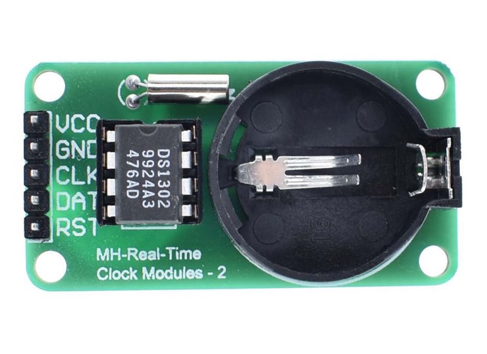

# **KIT DE 71 COMPONENTES ELECTRONICOS PARA MICRO:BIT Y ARDUINO**
*Componente dentro del kit de sensores, actuadores y componentes basicos para aula-laboratorio de informática y robótica*
# **Reloj digital DS1302**
## **1. Descripción**
Tipo de módulo: Módulo de reloj

Compatible con Arduino

Chip del reloj: DS1302

Batería excluida

Compatible TTL (Vcc = 5V) 

Capacidad de almacenamiento 32K

Voltaje de funcionamiento: 3.3 - 5.5V

Temperatura de funcionamiento: 0 a 70 ºC

Precisión del reloj:

Rango de 0 - 40

Precisión 2 ppm

Error de 1 minuto aprox

Generador en tiempo real segundos, minutos, horas, día, fecha, mes y año

Color: Verde

Tamaño: 44 X 23 X 11 mm (aprox)
## **2. Web de interes**
https://eloctavobit.com/modulos-sensores/real-time-clock-rtc-ds1302-modulo-reloj
## **3. Foto**

