# **KIT DE 71 COMPONENTES ELECTRONICOS PARA PROGRAMACIÓN CON MICRO:BIT Y PLATAFORMA ARDUINO**
*Kit de componentes electrónicos, sensores, actuadores y componentes basicos para aula-laboratorio de informática y robótica*

# 1. Descripción

[Micro: bit](http://microbit.org/guide/features/) es una pequeña tarjeta programable de 4x5 cm diseñada para que aprender a programar sea fácil, divertido y al alcance de todos. Gracias a la gran cantidad de sensores que incorpora, solo con la tarjeta micro bit se pueden llevar a cabo centenares de proyectos. Micro bit también es una plataforma IoT (Internet of Things), lo que la hace muy interesante para usuarios avanzados. Tiene un entorno de programación gráfico propio: MakeCode de Microsoft, un sencillo editor gráfico online muy potente y gratuito que posibilita introducirnos en el mundo de la programación de forma intuitiva a través del lenguaje de programación visual o de bloques.

Por otro lado Arduino es una plataforma de creación de electrónica de código abierto, la cual está basada en hardware y software libre, flexible y fácil de utilizar para los creadores y desarrolladores.

Este kit de componentes es compatible tanto con micro:bit como con la plataforma arduino. Está diseñado específicamente para completar y mejorar otros kits existentes en el mercado de forma que sea compatible con ellos.

# 3. Links de interes

Plataforma Micro:bit [Link](https://microbit.org/es-es/)

Plataforma Arduino [Link](https://www.arduino.cc/)

Github del fabricante Keyestudio y su kit de 45 componentes [Link](https://github.com/keyestudio/KS4009-4010-Keyestudio-Micro-bit-45-in-1-Sensor-Learning-Kit/tree/master)

Portal de Catedu de programación con Arduino Blocks [Link](https://libros.catedu.es/books/arduino-con-arduinoblocks)

# 3. Listado de componentes

| Nº.  | Artículo                                             | Cantidad  | Foto                                                      |
| ---- | ------------------------------------------------ | ---- | ------------------------------------------------------------ |
| 1  |  Placa BBC Microbit v2.2 | 1 |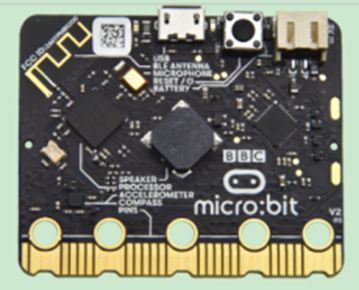 |
| 2  |  Micro bit Sensor Shield V2 Placa de Ampliación. | 1 |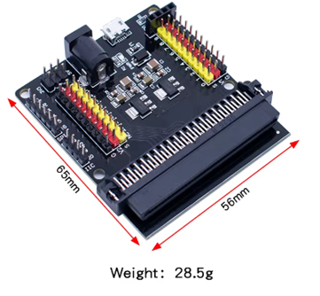 |
| 3  |  Placa ATMEGA328 con cable USB | 1 |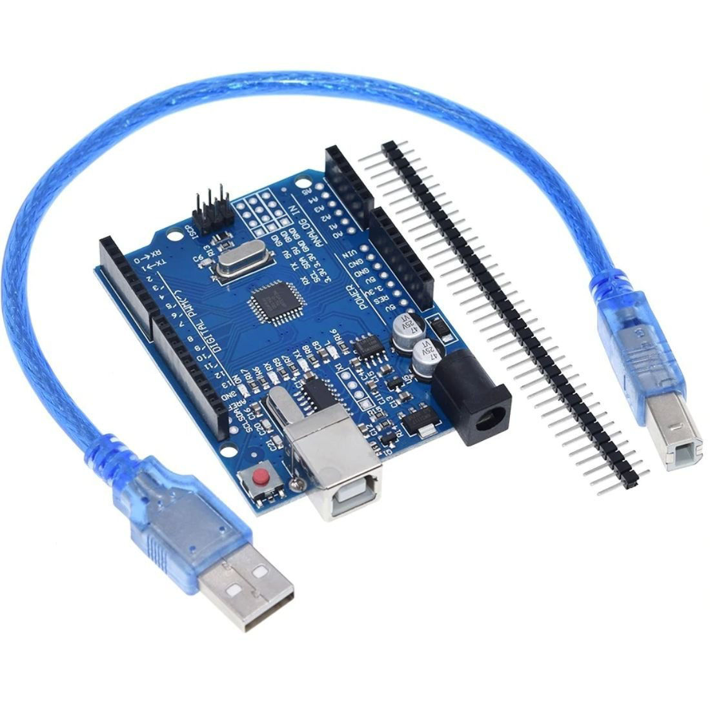 |
| 4  |  Pantalla Oled 0.96 | 1 |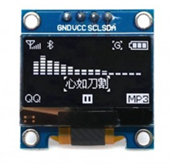 |
| 5  |  Pantalla LCD 1602 con I2C | 1 | |
| 6  |  Portapilas 6xAA | 1 | |
| 7  |  Cable USB-MicroUSB | 1 |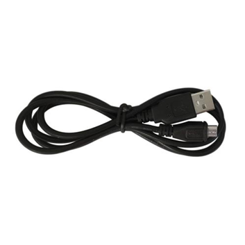 |
| 8  |  Placa de prototipos 830 puntos | 1 | |
| 9  |  Fuente de alimentación | 1 |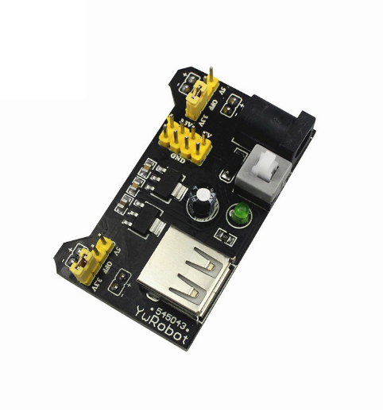 |
| 10  |  40 cables Hembra-Hembra Dupont de 20 cm | 1 |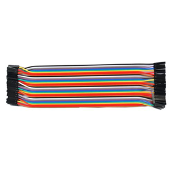 |
| 11  |  40 cables Macho-Hembra Dupont de 20 cm | 1 |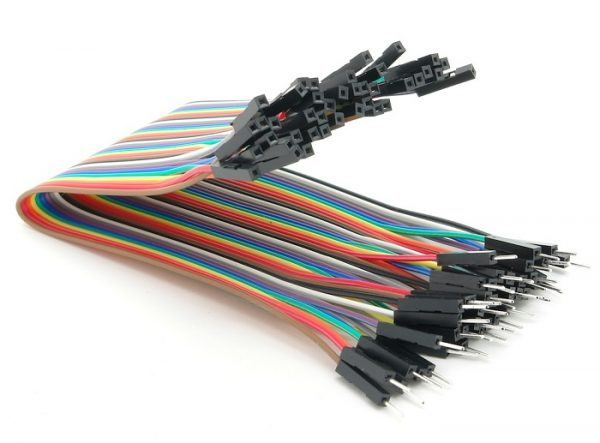 |
| 12  |  40 cables Macho-Macho Dupont de 20 cm | 1 |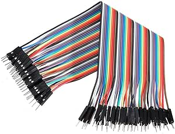 |
| 13  |  Led Bicolor KY-029 | 1 | |
| 14  |  LED RGB KY-016 | 1 | |
| 15  |  Led Bicolor KY-011 | 1 |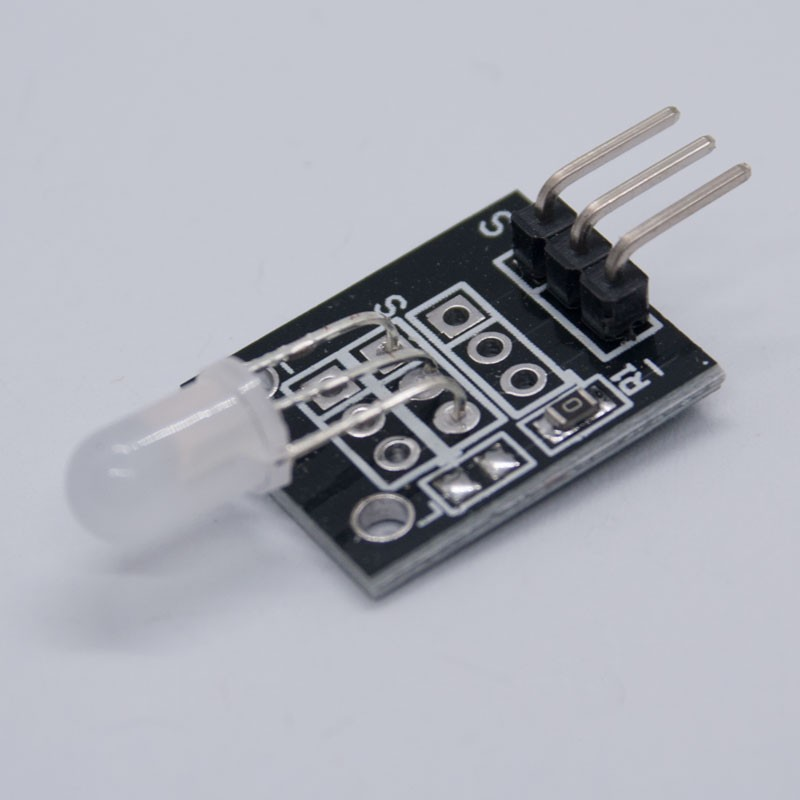 |
| 16  |  Led Intermitente KY-034 Flash de 7 colores  | 1 |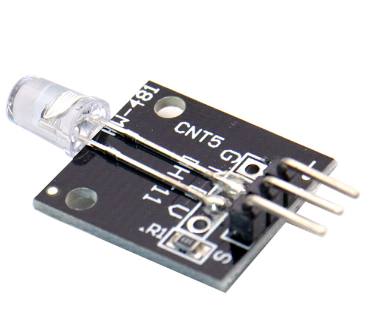 |
| 17  |  LED RGB SMD KY-009 | 1 | |
| 18  |  Diodo Emisor IR KY-005 | 1 |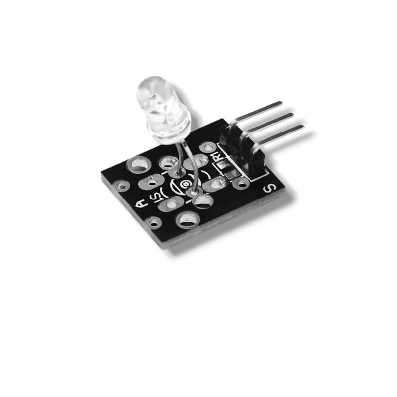 |
| 19  |  Diosdo emisor laser | 1 |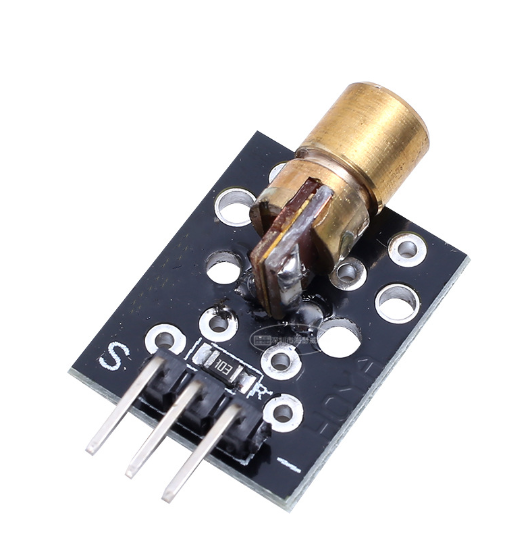 |
| 20  |  Zumbador Pasivo KY-006 | 1 |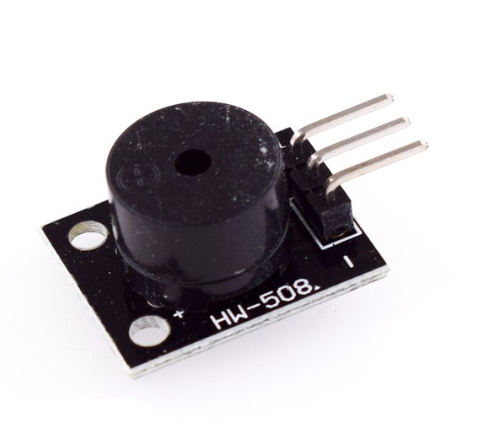 |
| 21  |  Zumbador Activo KY-012 | 1 |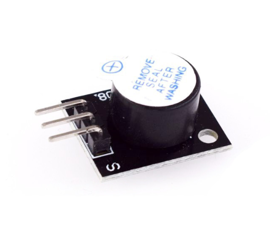 |
| 22  |  Sensor de temperatura con NTC analógico KY-013 | 1 |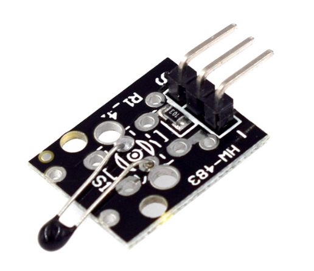 |
| 23  |  Sensor Fotoresistor KY-018 | 1 |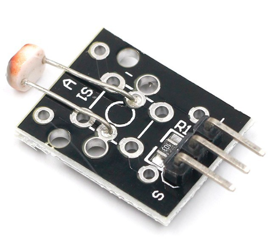 |
| 24  |  Sensor de rotación analógico KY-040 | 1 |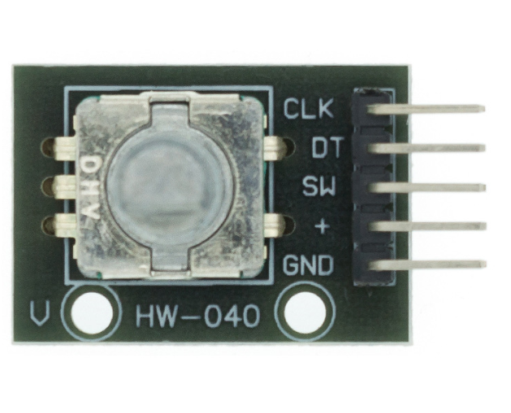 |
| 25  |  Módulo Pulsador Digital KY-004 | 1 | |
| 26  |  Sensor de inclinación KY-020 | 1 | |
| 27  |  Sensor Foto-interruptor KY-010 | 1 | |
| 28  |  Sensor Hall KY-003 | 1 | |
| 29  |  Sensor Reed, interruptor KY-021 | 1 |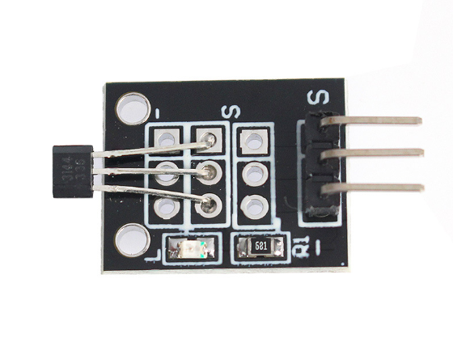 |
| 30  |  Sensor de temperatura LM35 | 1 |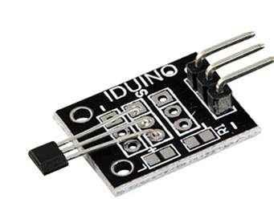 |
| 31  |  Sensor Vibración KY-002 | 1 | |
| 32  |  Sensor de Impacto KY-031 | 1 | |
| 33  |  Receptor de Infrarojos KY-022 | 1 | |
| 34  |  Sensor de temperatura DHT11 | 1 | |
| 35  |  Sensor Temperatura 18B20 KY-001 | 1 | |
| 36  |  Sensor ritmo cardiaco KY-039 | 1 | |
| 37  |  Sensor hall KY-035 | 1 | |
| 38  |  Sensor Magic Light Cup KY-027. Funcionan con mercurio, NO SE SUMINISTRAN POR PRECAUCIÓN | 1 | |
| 39  |  Sensor inclinacion KY-037 NO SE SUMINISTRAN POR PRECAUCIÓN | 1 | |
| 40  |  Módulo LED 3W Blanco | 1 | |
| 41  |  Módulo tres led "Semáforo" | 1 |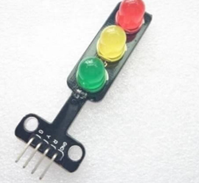 |
| 42  |  Micro Servo SG90 | 1 |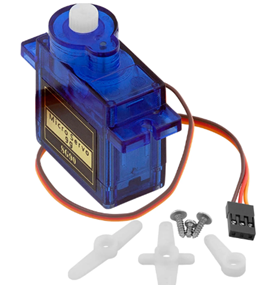 |
| 43  |  Módulo de Relé | 1 |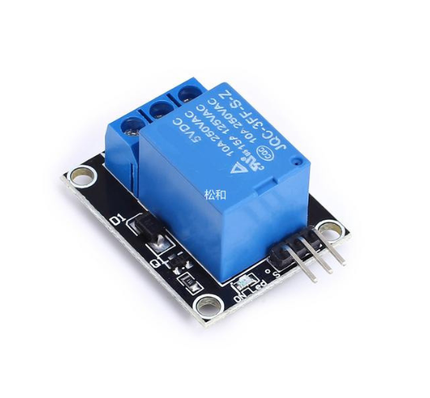 |
| 44  |  Mini Ventilador L9110 | 1 | |
| 45  |  Mando a distancia Infrarojo | 1 | |
| 46  |  Sensor de temperatura con NTC digital KY-028 | 1 | |
| 47  |  Sensor Analógico de Sonido, Micrófono KY-037 | 1 |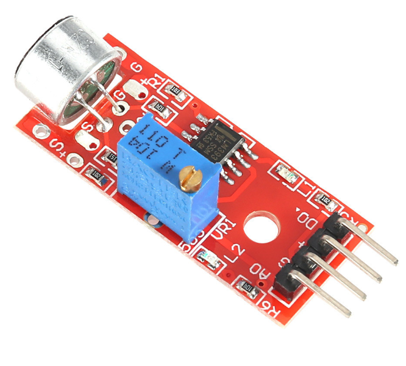 |
| 48  |  Sensor Analógico de Sonido, Micrófono KY-038. | 1 | |
| 49  |  Sensor Hall 49E | 1 | |
| 50  |  Sensor de llama KY-026 | 1 | |
| 51  |  Sensor Reed, interruptor KY025 | 1 | |
| 52  |  Sensor táctil darlington KY-036 | 1 | |
| 53  |  Sensor táctil | 1 |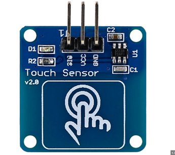 |
| 54  |  Sensor Seguidor de Líneas | 1 | |
| 55  |  Sensor detector de obstáculos infrarojo | 1 | |
| 56  |  Detector de presencia PIR HC-SR-501 | 1 | |
| 57  |  Sensor de choque (final de carrera) | 1 | |
| 58  |  Sensor de gas MQ-8 | 1 | |
| 59  |  Sensor de Alcohol MQ-3 | 1 |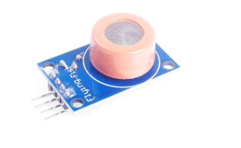 |
| 60  |  Sensor de lluvia | 1 | |
| 61  |  Sensor de humedad en suelo | 1 | |
| 62  |  Sensor de presión táctil | 1 | |
| 63  |  Sensor GUVA-S12D 3528 Luz Ultravioleta | 1 | |
| 64  |  Sensor TEMP6000 de luz ambiental | 1 |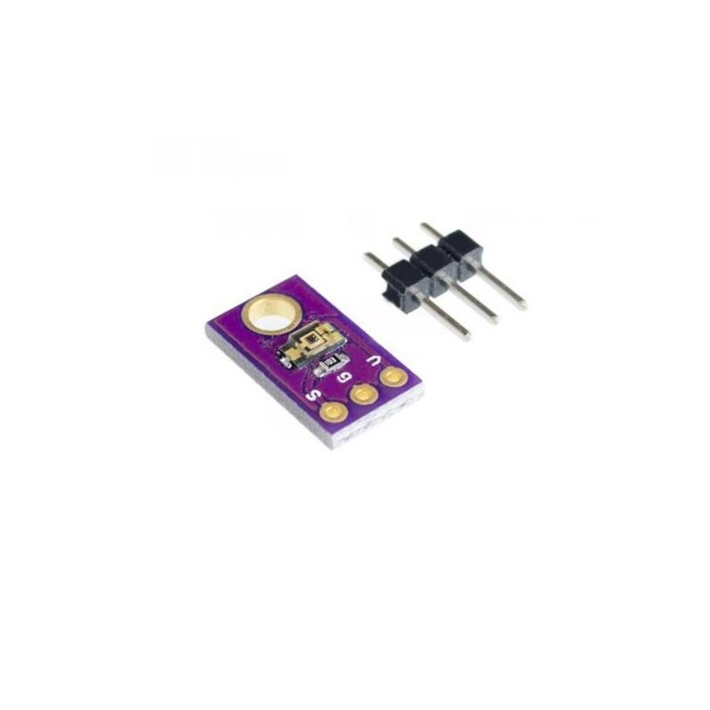 |
| 65  |  Sensor Ultrasonidos HC-SR04 | 1 |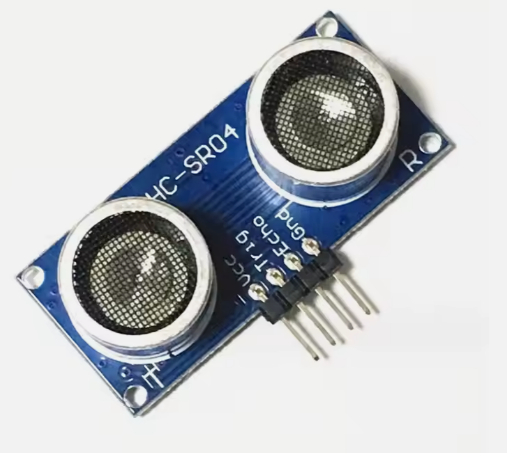 |
| 66  |  Módulo Joystick | 1 |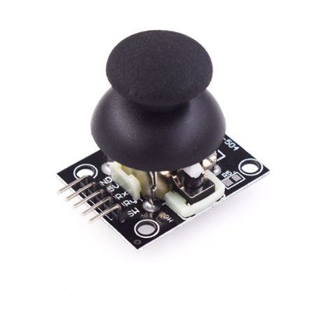 |
| 67  |  Módulo Sensor de Vapor | 1 | |
| 68  |  Sensor giroscopio gy-521 | 1 | |
| 69  |  Lector tarjeta SD | 1 | |
| 70  |  Regulador tensión MP1584EN | 1 |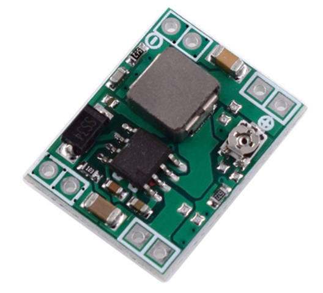 |
| 71  |  Reloj digital DS1302 | 1 | |

